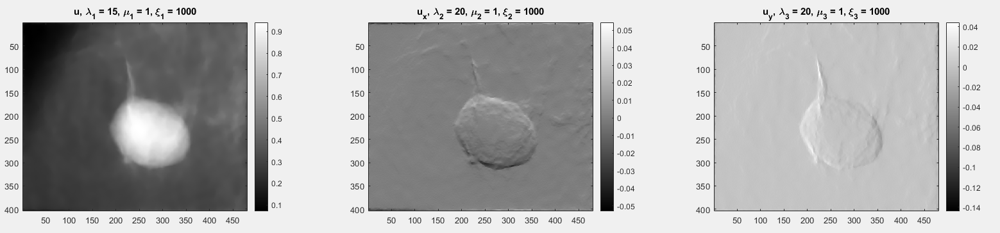
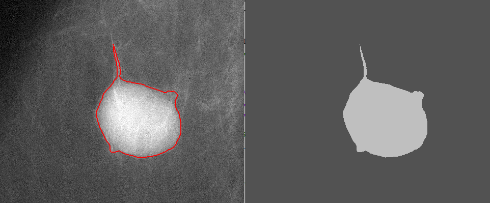
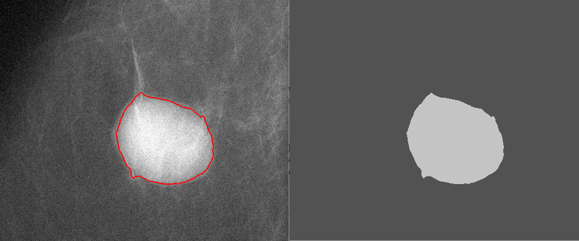

# Variational-and-Convex-Model-of-the-Blake-Zisserman-Type-for-Segmentation-of-Low-Contrast
Implementation of "On a Variational and Convex Model of the Blake-Zisserman Type for Segmentation of Low Contrast and Piecewise-smooth Images"

Paper: https://www.mdpi.com/2313-433X/7/11/228

Implementation in MATLAB and Python

For the matlab implementation, use the "run.m" file for a quick start.
For the python implementation, use "main.py" for a quick start.

Python requirements:

- opencv
- numpy
- matplotlib

## Example output:
.

## Segmentation Option 1:
.

## Segmentation Option 2:
.
